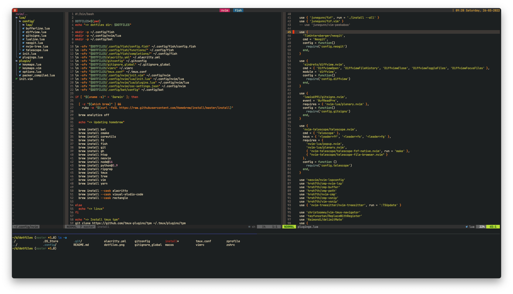

# My Dotfiles

## Screenshot



## Installation

Clone the dotfiles repository.

```
$ cd ~
$ git clone https://github.com/tayfunoztan/dotfiles.git
$ cd dotfiles
$ ./install
```

### fish shell

On macOS you'll have to add fish's
path to `/etc/shells`.

```
chsh -s $(which fish)
```
